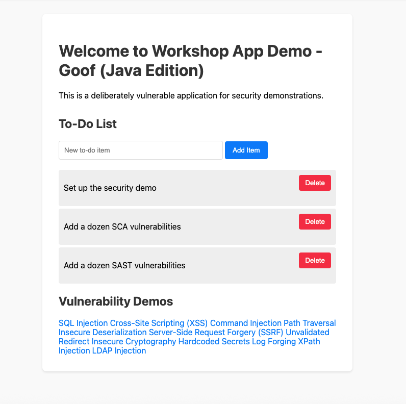

# Workshop App Demo - Goof (Java Edition)

This is a deliberately vulnerable web application created for security demonstration purposes. It is designed to showcase a variety of security vulnerabilities, making it an ideal tool for security training and workshops.

## Features

- **SAST Vulnerabilities**: A dozen examples based on the OWASP Top 10.
- **SCA Vulnerabilities**: Includes dependencies with known critical vulnerabilities like Log4Shell.
- **Container Vulnerabilities**: A `Dockerfile` using a known vulnerable base image.
- **IaC Misconfigurations**: Terraform files with common security flaws.

## Screenshot



## Getting Started

### Prerequisites

- [Java 11 or higher](https://www.oracle.com/java/technologies/downloads/)
- [Maven](https://maven.apache.org/)

### Installation & Running the App

1.  **Clone the repository:**
    ```bash
    git clone https://github.com/JennySnyk/Workshop-App-Demo-Goof-Java.git
    ```
2.  **Navigate to the project directory:**
    ```bash
    cd Workshop-App-Demo-Goof-Java
    ```
3.  **Build the application:**
    ```bash
    mvn clean install
    ```
4.  **Start the application:**
    ```bash
    java -jar target/goof-0.0.1-SNAPSHOT.jar
    ```

The application will be available at `http://localhost:8080`.

## Vulnerability Details

Here are some of the vulnerabilities included in this application and how to trigger them:

- **SQL Injection:**
  - `http://localhost:8080/sqli?id=1' OR '1'='1`
- **Cross-Site Scripting (XSS):**
  - `http://localhost:8080/xss?input=<script>alert('xss')</script>`
- **Command Injection:**
  - `http://localhost:8080/command-injection?host=8.8.8.8; ls`
- **Path Traversal:**
  - `http://localhost:8080/path-traversal?file=../../../../../../../../../../../../etc/passwd`
- **Server-Side Request Forgery (SSRF):**
  - `http://localhost:8080/ssrf?url=https://www.google.com`

## Disclaimer

**This application is for educational and demonstration purposes only. Do not deploy it in a production environment.**
